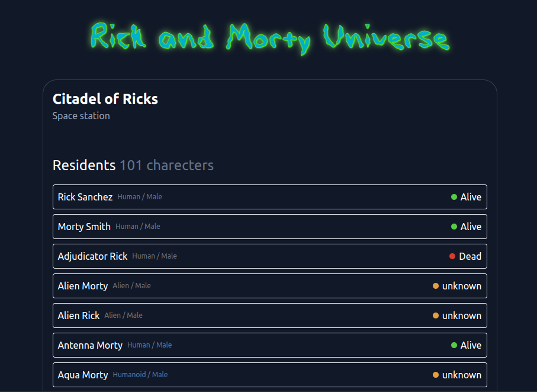

# Find Rick and Morty

Find any character from the Rick and Morty universe. Powered by [`rickandmortyapi`](https://rickandmortyapi.com/) API.

[Try on GitHub Pages](https://gvozdenkov.github.io/find-rick-and-morty/)


|                                                        |                                                           |
| :----------------------------------------------------: | :-------------------------------------------------------: |
|  |  |

## About

- [x] - Automatic dark/light theme
- [x] - Find by name, status and species
- [x] - Charecter detailed view
- [x] - Location detailed view
- [ ] - Find by Episode. The [`rickandmortyapi`](https://rickandmortyapi.com/) API doesn't have this functionality yet

## What's next

- [ ] - Add pagination page numbers
- [ ] - Add 'Not found' message (refactor layout to show results and 'Not found' in Outlet of main layout )
- [ ] - Place search results in a scrollable window so that pagination buttons and footer don't go beyond the edge of the viewport
- [ ] - Remove Tailwind and implement SASS design system
- [ ] - Improve UI of charecter detail view

## Development

Run the dev server:

```shellscript
npm ci

npm run dev
```

## Deployment

Automatically deploy to the GitHub Pages via github actions when pushing to `main` branch
